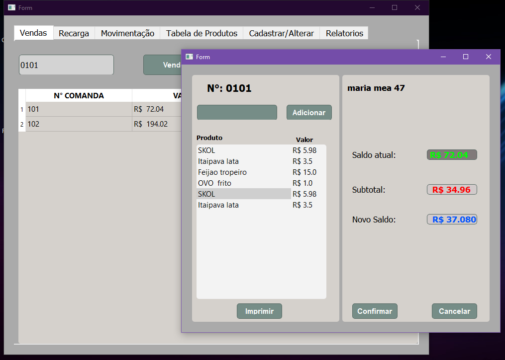
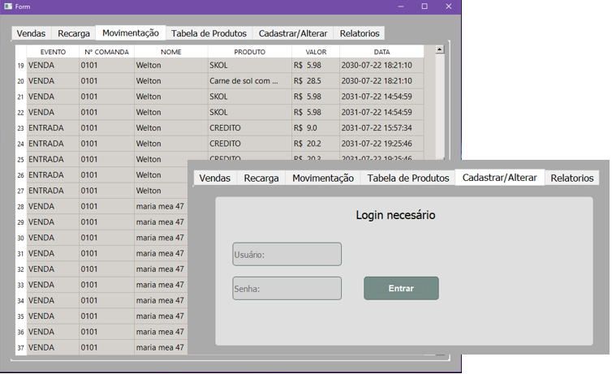

# Comanda pré-paga





> Projeto pensado para casas noturnas e bares, onde o cliente recebe um cartão com o codigo único podendo adiconar valor para o consumo no resínduo, e ao final da noite recupar o valor restante. Podendo tambem ser ultilizado como uma "carteirinha fidelidade". Tudo fica registrado em uma tabela sql, inclusive todas as movimentações de entrada e saída.

### Ajustes e melhorias

O projeto ainda está em desenvolvimento e as próximas atualizações serão voltadas nas seguintes tarefas:

- [x] Editar usuário do sistema
- [x] Editar produtos
- [ ] Elaborar relatórios
- [ ] Adicionar opção de envio de relatório por e-mail
- [ ] BackUp do banco de dados em nuvem

## 💻 Pré-requisitos

Antes de começar, verifique se você atendeu aos seguintes requisitos:

* Você instalou a versão  `Python 3.9 ou superior / Gerenciador de pacotes PIP>`
* Você tem uma máquina `<Windows / Linux (não funciona o modulo de impressão dos pedidos da cozinha)>`. 


## 🚀 Instalando <Comanda pré-paga>

Para instalar o <Comanda pré-paga>, siga estas etapas:

### Linux:
```
<pip install sqlite3 win32api bcrypt pymysql win32print datetime PyQt5 time os threading>
```
ou
```
<pip3 install sqlite3 win32api bcrypt pymysql win32print datetime PyQt5 time os threading>
```

### Windows:
```
<pip install sqlite3 win32api bcrypt pymysql win32print datetime PyQt5 time os threading>
```
ou
```
<pip3 install sqlite3 win32api bcrypt pymysql win32print datetime PyQt5 time os threading>
```

## 👨🏻‍💻 Contato:

* 📧 weltonmoura@live.com
* 📱 [Linkedin](https://www.linkedin.com/in/welton-moura-23a897230)


[⬆ Voltar ao topo](#Comanda pré-paga)<br>
